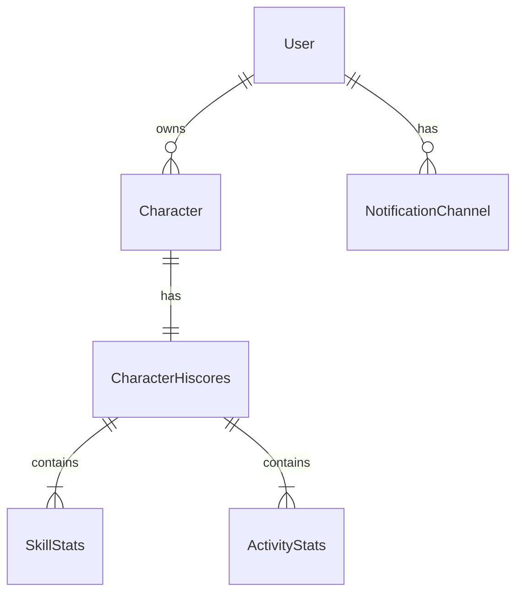

# Data Models

## Overview

All models in the service follow these principles:
- Immutable using Lombok `@Value`
- Builder pattern using Lombok `@Builder`
- Request objects use `@Data` with `@NoArgsConstructor`
- Clear separation between domain models and DTOs
- Validation using Jakarta Validation annotations

## Domain Models

### User Domain

```java
@Value
@Builder
public class User {
    String userId;
    String email;
    LocalDateTime createdAt;
    LocalDateTime updatedAt;
}
```

## Database Models

### DynamoDB Entities

```java
public class UserEntity {
    @DynamoDBHashKey
    private String userId;
    
    @DynamoDBAttribute
    private String email;
    
    @DynamoDBAttribute
    private String createdAt;
    
    @DynamoDBAttribute
    private String updatedAt;
}

## Model Relationships



## Model Conversion

Each domain should provide mapper methods for converting between different model representations:

```java
public class UserMapper {
    public static User fromEntity(UserEntity entity) {
        return User.builder()
            .userId(entity.getUserId())
            .email(entity.getEmail())
            .createdAt(parseDateTime(entity.getCreatedAt()))
            .updatedAt(parseDateTime(entity.getUpdatedAt()))
            .build();
    }
    
    public static UserEntity toEntity(User user) {
        UserEntity entity = new UserEntity();
        entity.setUserId(user.getUserId());
        entity.setEmail(user.getEmail());
        entity.setCreatedAt(formatDateTime(user.getCreatedAt()));
        entity.setUpdatedAt(formatDateTime(user.getUpdatedAt()));
        return entity;
    }
}
``` 